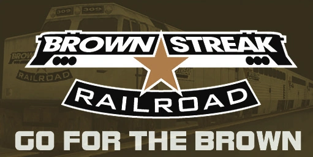

# Brown Streak
<p align="center">
  
</p>

## Description
If you've played GTA San Andreas, you'll surely know this legendary train company that runs along the tracks of the map from one end to the other through various stations. This project simulates a website for clients who want to travel with Brown Streak in the state of San Andreas, helping them check the ticket cost according to the chosen stations and to consult information of interest.

## Technologies Used
- [Angular CLI](https://github.com/angular/angular-cli) v17.1.0.
- [Bootstrap](https://getbootstrap.com/) v5.3

## Run the application
To run the application, you need to have [Node.js](https://nodejs.org/en), [Angular CLI](https://github.com/angular/angular-cli) and [Git](https://git-scm.com) installed. Then open the terminal and execute the following instructions:

- Clone the repository
```git
git clone https://github.com/wikicode96/brown-streak.git
```
- Install dependencies
``` shell
npm install
```
- Run the server
``` shell
ng serve
```
- Open your browser and go to the address http://localhost:4200